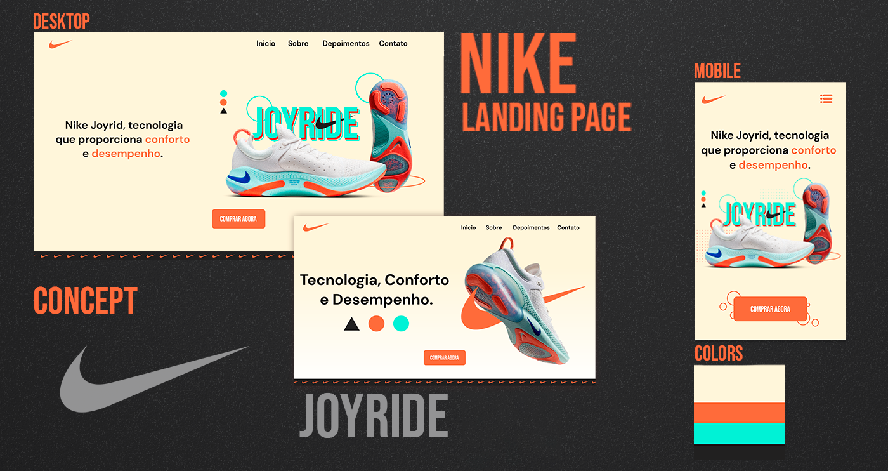

  <a href="#-tecnologias">Tecnologias</a>&nbsp;&nbsp;&nbsp;|&nbsp;&nbsp;&nbsp;
  <a href="#-projeto">Projeto</a>&nbsp;&nbsp;&nbsp;|&nbsp;&nbsp;&nbsp;
  <a href="#-layout">Layout</a>&nbsp;&nbsp;&nbsp;

 

  

## 🚀 Tecnologias

Esse projeto foi desenvolvido com as seguintes tecnologias:

- HTML
- CSS
- JavaScript

Bibliotecas

- [Google Fonts](https://fonts.google.com/)
- [SwipeJS](https://github.com/nolimits4web/Swiper)
- [ScrollRevel](https://scrollrevealjs.org)

## 💻 Projeto

- Projeto de landing page para a marca esportiva Nike, utilizada como estudo e totalmente deselvolvida por mim (marciovinicius1) desde o design ao código.  
- Contém as seguintes seções: Header, Navigation, Home, Sobre, Depoimentos, Contato e Footer.  
- O projéto foi desenvolvido apartir do conceito Mobile Frist para melhor performance e acessibilidade.

## 🔖 Layout

Você pode visualizar o layout do projeto através [desse link](https://www.figma.com/community/file/1075103965574324150/Nike-Joyrid---Landing-Page-Design). É necessário ter conta no [Figma](https://figma.com) para acessá-lo. 
Caso prefira o projeto no Behance através [desse link](https://www.behance.net/gallery/138962389/Landing-Page-and-Designs-Nike-Joyride).
 

---

Feito com ♥ by marciovinicius1 🍂 [Vamos nos conectar no Linkedin?](https://www.linkedin.com/in/marciovinicius1/)
